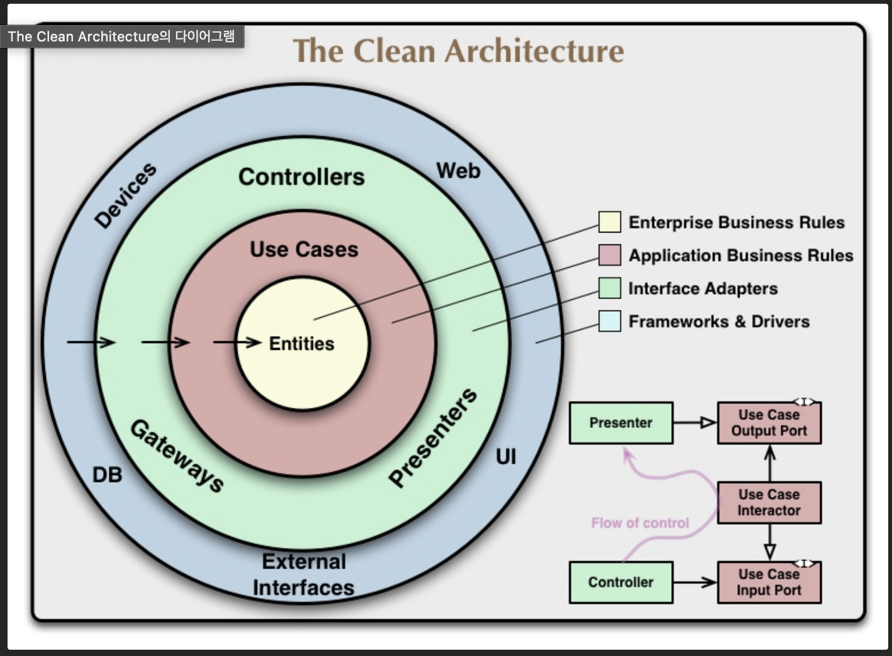

## 개요

Spring Boot 를 활용해서 클린 아키텍처를 구현한 예제입니다. 회원 가입이라는 간단한 주제를 가지고 구현하였습니다. 실제 동작을 확인하려면 @Component 혹은 @Service 어노테이션 정의를 통해 빈 설정을 해주어야 합니다.   




### 패키지 구조 
```
users
└───core : 각 컴포넌트의 인터페이스가 존재합니다. 
    └───entity
        -> 핵심 비즈니스 규칙이 포함된 entity입니다.  
    └───repository
        -> 데이터를 저장하는(영속화) 데 사용되는 인터페이스가 존재합니다. 
    └───presenter
        -> UI로 넘어가기 전에 도메인 로직에 대한 성공/실패 처리를 정의하는 presenter 인터페이스가 존재합니다.
    └───usecase
        -> usecase 즉 내가 만들고자 하는 시스템(혹은 서비스)을 사용하는 클라이언트가 그 시스템을 통해 하고자 하는 것이 정의된 인터페이스 및 구현체입니다.
    └───dto
        -> 각 컴포넌트 사이에 전달되는 dto가 존재합니다.  
    adapters : 각 컴포넌트의 인터페이스를 하부 기술을 활용해 구현한 구현체들이 존재합니다.  
    └───repository.jpa
        -> Jpa라는 하부 기술을 활용해 core.repository에 정의된 인터페이스의 구현체가 존재합니다. 
    └───web
        -> usecase를 활용해 웹 컨트롤러를 구현한 구현체가 존재합니다. 
    └───presenter.web
        -> usecase 의 결과를 web Rest API로 어떻게 전달할지 구현한 구현체가 존재합니다.   
```

### 특징 

클린 아키텍쳐에서는 시스템에서 중요한 것이 시스템에서 하고자 하는 것을 명확히 설명하는 것이라고 합니다. 그래서 어떤 기술 스택 및 프레임워크를 사용하는 것이 중요하지 않으며, 웹인지 앱인지 어떤 형태인지도 중요하지 않습니다.
그 시스템이 클라이언트에게 어떤 것을 제공하는 지 명확히 말해줄 수 있는 아키텍처가 좋은 아키텍처라고 합니다.
따라서 클린 아키텍처에서는 시스템이 클라이언트에게 어떤 것을 제공하는지 말해주는 UseCase가 핵심이며 해당 UseCase를 구현하는 구현체(기술)은 언제든지 바뀔 수 있어야 하기 때문에 Loose Coupling을 유지하는 것이 핵심입니다. 

- 대부분의 컴포넌트는 인터페이스로 추상화되어 있어, 프레임워크, 라이브러리 등의 하부 기술에 종속적이지 않습니다. 
- 즉 비즈니스 로직은 어떤 DB나 어떤 UI를 사용하든 간 영향을 받지 않습니다.


### 참고 자료
- https://www.baeldung.com/spring-boot-clean-architecture
- https://betterprogramming.pub/the-clean-architecture-beginners-guide-e4b7058c1165